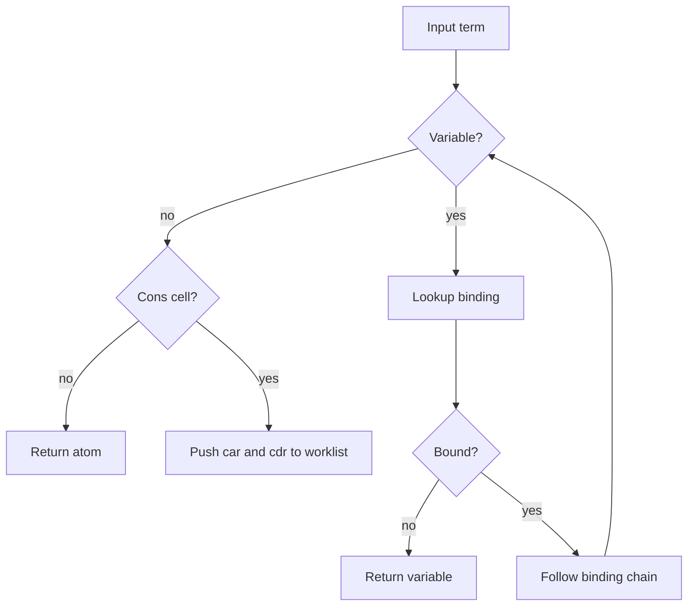
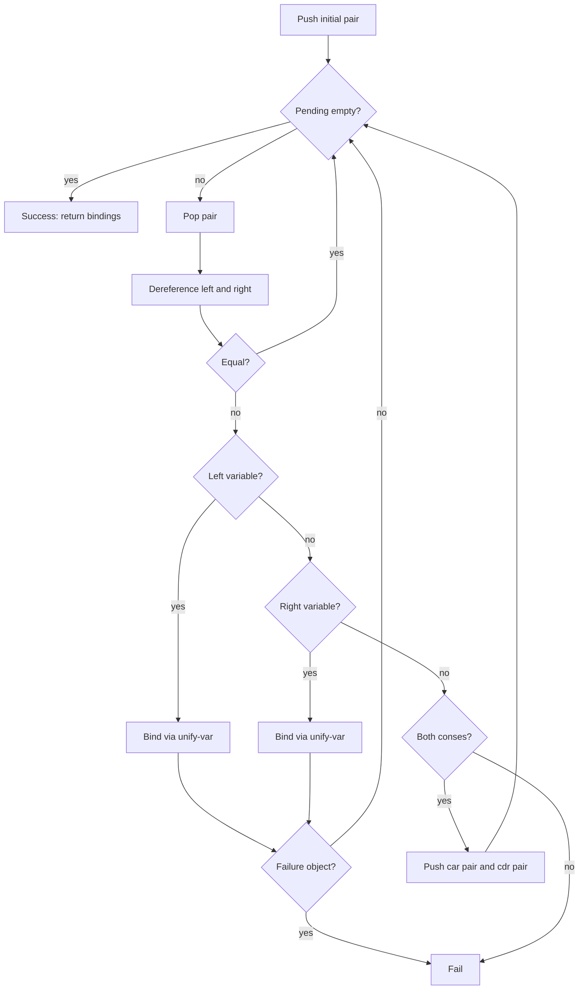
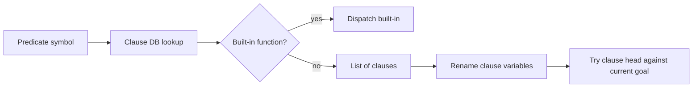
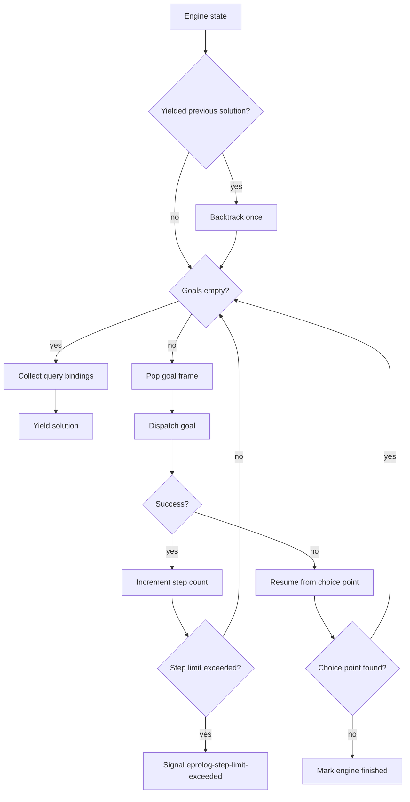
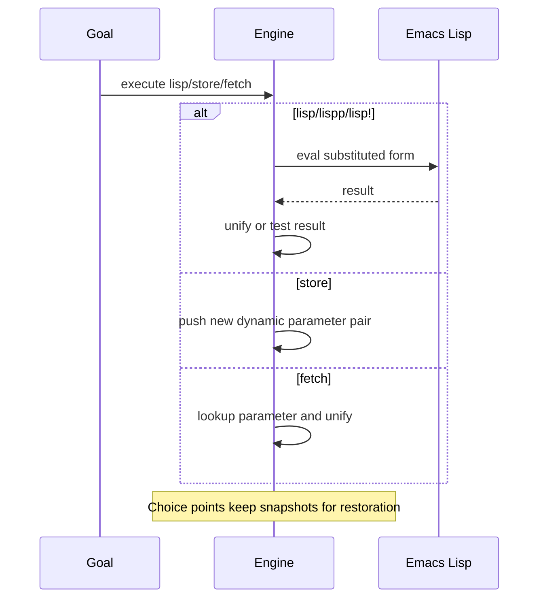
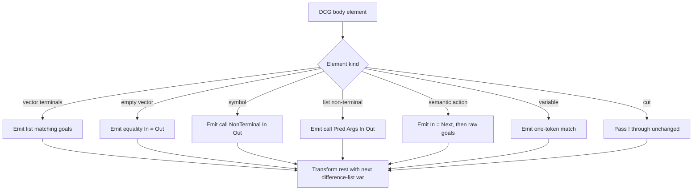
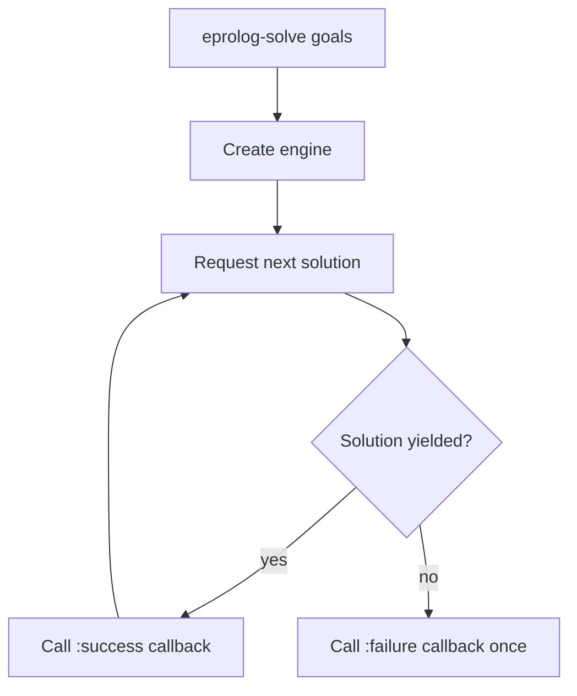

# eprolog Code Guide

This guide explains the main algorithms in [`eprolog.el`](./eprolog.el) and how they fit together.

The implementation is organized around an iterative Prolog engine. Search does not recurse through Lisp calls. Instead, it advances an explicit engine state containing:

- pending goals
- current bindings
- choice points
- dynamic parameters
- cut boundaries

## File Layout

- Term and variable operations: [`eprolog.el:130`](./eprolog.el:130)
- Unification: [`eprolog.el:268`](./eprolog.el:268)
- Clause database: [`eprolog.el:359`](./eprolog.el:359)
- Iterative engine: [`eprolog.el:428`](./eprolog.el:428)
- Public API and predicate definition: [`eprolog.el:763`](./eprolog.el:763)
- Built-ins: [`eprolog.el:866`](./eprolog.el:866)
- DCG transformation: [`eprolog.el:1092`](./eprolog.el:1092)

## 1. Term Traversal and Variable Handling

Relevant code:

- [`eprolog--variable-p`](./eprolog.el:130)
- [`eprolog--dereference-term`](./eprolog.el:156)
- [`eprolog--substitute-bindings`](./eprolog.el:174)
- [`eprolog--variables-in`](./eprolog.el:201)
- [`eprolog--replace-anonymous-variables`](./eprolog.el:220)
- [`eprolog--ground-p`](./eprolog.el:244)

### What this part does

This layer answers basic structural questions about Prolog terms:

- Is this symbol a variable?
- What does this variable currently point to?
- Which named variables are visible in a query?
- How do we replace `_` with unique variables?
- Is a term ground after current substitutions?

All of these routines are iterative. They use explicit worklists rather than recursive descent, which keeps deep terms from growing the Lisp call stack.

### Core idea

Bindings are an alist from variables to values. Before almost any semantic operation, the code dereferences a variable chain until it reaches:

- an unbound variable
- a non-variable term
- or a cycle guard

### Mermaid



### Notes

- `eprolog--substitute-bindings` rebuilds a term using a synthetic root cell and a worklist of `(current parent slot visited)`.
- `eprolog--replace-anonymous-variables` ensures each `_` becomes a fresh `gensym`, so anonymous variables do not accidentally unify with each other.
- `eprolog--ground-p` evaluates groundness after substitution through `eprolog-current-bindings`.

## 2. Occurs Check and Unification

Relevant code:

- [`eprolog--occurs-check-p`](./eprolog.el:268)
- [`eprolog--unify-var`](./eprolog.el:296)
- [`eprolog--unify`](./eprolog.el:317)

### What this part does

This is the core Prolog term unifier. It tries to make two terms equal by extending bindings.

The implementation is iterative:

- `pending` is a stack of term pairs that still need to be unified
- each pair is dereferenced first
- variable cases delegate to `eprolog--unify-var`
- cons cells expand into two more pending pairs

### Algorithm

1. Start with one pending pair `(term1 . term2)`.
2. Pop a pair.
3. Dereference both sides through current bindings.
4. Handle cases:
   - same value: continue
   - left is variable: bind left
   - right is variable: bind right
   - both conses: push `car` pair and `cdr` pair
   - otherwise: fail
5. If all pending pairs are consumed, return updated bindings.

### Mermaid



### Notes

- `eprolog--occurs-check-p` prevents cyclic terms when `eprolog-occurs-check` is non-nil.
- Failure is represented by the private `eprolog--failure` struct.
- Unification itself is iterative, but term data remains standard Lisp lists and atoms.

## 3. Clause Database and Clause Preparation

Relevant code:

- [`eprolog--get-clauses`](./eprolog.el:359)
- [`eprolog--set-clauses`](./eprolog.el:369)
- [`eprolog--add-clause`](./eprolog.el:382)
- [`eprolog--remove-clauses-with-arity!`](./eprolog.el:394)
- [`eprolog--rename-vars`](./eprolog.el:409)

### What this part does

The clause database is an alist:

- key: predicate symbol
- value: list of clauses, or a Lisp function for built-ins

Before a user-defined clause is tried, its variables are renamed fresh. This avoids variable capture between:

- the active query
- previous clause attempts
- recursive re-entry into the same predicate

### Mermaid



### Notes

- `eprolog-define-prolog-predicate!` removes clauses by same predicate and arity before adding the new clause.
- `eprolog--rename-vars` depends on `eprolog--variables-in` and `gensym`.

## 4. Iterative Search Engine

Relevant code:

- structs: [`eprolog--goal-frame`](./eprolog.el:428), [`eprolog--choice-point`](./eprolog.el:433), [`eprolog--engine`](./eprolog.el:443)
- engine creation: [`eprolog--make-engine`](./eprolog.el:484)
- clause search: [`eprolog--try-clauses`](./eprolog.el:507)
- backtracking: [`eprolog--resume-from-choice-point`](./eprolog.el:539)
- dispatch: [`eprolog--dispatch-goal`](./eprolog.el:626)
- main loop: [`eprolog--engine-next-solution`](./eprolog.el:654)

### What this part does

This is the replacement for the old continuation-based evaluator.

The engine stores search state explicitly:

- `goals`: stack of pending goal frames
- `bindings`: current substitution environment
- `choice-points`: saved alternatives for backtracking
- `dynamic-parameters`: backtrackable state store
- `query-variables`: variables visible to the caller
- `step-count`: optional safety limit

### Goal frame

A goal frame stores:

- the goal term
- `cut-base`, the choice-point depth to keep if `!` executes inside this clause scope

### Choice point

A choice point stores:

- what kind of alternative is pending
- remaining clauses or remaining branches
- pending goals at the snapshot
- bindings at the snapshot
- dynamic parameters at the snapshot
- the `cut-base` for resumed execution

### Main search loop

1. If a previous solution was yielded, backtrack once before resuming.
2. While the engine is not finished:
   - if no goals remain, emit one solution
   - otherwise pop one goal frame
   - dispatch built-in or user-defined predicate
   - on failure, resume from the nearest choice point
3. If no choice point remains, the solve is exhausted.

### Mermaid



### Clause selection and backtracking

`eprolog--try-clauses` tries clauses in source order. When a clause matches:

- remaining clauses are saved as a choice point
- the clause body is prepended to pending goals
- current bindings become the unified bindings

If the active path later fails, `eprolog--resume-from-choice-point` restores the saved snapshot and continues with the next clause or branch.

### Notes

- The engine is depth-first.
- Search is iterative, not trampolined CPS.
- `eprolog-max-steps` signals `eprolog-step-limit-exceeded` instead of pretending the query logically failed.

## 5. Cut, Meta-Call, and Control Predicates

Relevant code:

- `!`: [`eprolog.el:886`](./eprolog.el:886)
- `call`: [`eprolog.el:895`](./eprolog.el:895)
- `and`: [`eprolog.el:917`](./eprolog.el:917)
- `or-2` and `or`: [`eprolog.el:921`](./eprolog.el:921), [`eprolog.el:939`](./eprolog.el:939)
- `not`: [`eprolog.el:1035`](./eprolog.el:1035)
- `if/2`, `if/3`: [`eprolog.el:1041`](./eprolog.el:1041)
- `repeat`: [`eprolog.el:1053`](./eprolog.el:1053)

### Cut

Cut is implemented by trimming the choice-point stack back to the current frame's `cut-base`.

That means:

- clause-local alternatives are discarded
- outer alternatives older than the clause boundary remain
- `call` gets its own cut boundary based on the current choice-point depth

### Mermaid


### `call`

`call` substitutes the callable term, builds a goal, and pushes it back onto the engine goal stack. It does not recursively invoke the engine.

### `not`

`not` is encoded as:

```prolog
not(G) :- call(G), !, fail.
not(_).
```

So:

- if `G` succeeds once, cut commits and `fail` makes `not(G)` fail
- if `G` fails, the fallback clause succeeds

### `if`

`if/2` and `if/3` are encoded with explicit cut:

```prolog
if(C, T)    :- call(C), !, call(T).
if(C, T, E) :- call(C), !, call(T).
if(C, T, E) :- call(E).
```

This gives commitment semantics after the first successful condition branch.

### `repeat`

`repeat` is encoded as:

```prolog
repeat.
repeat :- repeat.
```

Under the iterative engine, repeated backtracking through `repeat` reuses engine state instead of growing the Lisp stack.

## 6. Lisp Integration and Backtrackable Dynamic State

Relevant code:

- [`eprolog--eval-lisp-expressions`](./eprolog.el:754)
- `lisp`: [`eprolog.el:962`](./eprolog.el:962)
- `lisp!`: [`eprolog.el:972`](./eprolog.el:972)
- `lispp`: [`eprolog.el:976`](./eprolog.el:976)
- `store`: [`eprolog.el:985`](./eprolog.el:985)
- `fetch`: [`eprolog.el:1000`](./eprolog.el:1000)

### What this part does

These predicates bridge Prolog search and Emacs Lisp evaluation.

- `lisp`: evaluate and unify result
- `lisp!`: evaluate for side effects, succeed if expressions are ground
- `lispp`: evaluate and interpret non-nil as success
- `store`: push a dynamic parameter binding
- `fetch`: read a stored parameter and unify it

Each Lisp predicate returns either `eprolog--make-success` with the next
engine state or `eprolog--make-failure`. The evaluator stays iterative; the
result object only carries state and does not reintroduce continuations.

### Dynamic parameter semantics

Dynamic parameters are restored by ordinary backtracking because each choice point saves its own snapshot of `dynamic-parameters`.

### Mermaid



## 7. DCG Transformation

Relevant code:

- [`eprolog--transform-dcg-body`](./eprolog.el:1092)
- [`eprolog--define-grammar-impl`](./eprolog.el:1159)
- `phrase/2`, `phrase/3`: [`eprolog.el:1182`](./eprolog.el:1182)

### What this part does

DCG rules are compiled into ordinary Prolog predicates over difference lists.

For a grammar rule:

```prolog
sentence --> noun_phrase, verb_phrase.
```

the implementation builds an internal predicate shape roughly like:

```prolog
sentence(In, Out) :-
  noun_phrase(In, Mid),
  verb_phrase(Mid, Out).
```

### Handled DCG body forms

- vector terminals
- empty vector epsilon
- non-terminals with or without arguments
- semantic actions `(@ ...)`
- variables
- cut

### Mermaid



### Notes

- DCG compilation happens at definition time, not during search.
- `phrase/2` and `phrase/3` are thin wrappers over `call`.

## 8. Public Solve Path

Relevant code:

- [`eprolog-solve`](./eprolog.el:763)
- [`eprolog-query`](./eprolog.el:846)

### What this part does

`eprolog-solve` creates one engine and repeatedly asks it for the next solution.

`eprolog-query` is the interactive wrapper that prints a solution and asks whether to continue.

### Mermaid



## 9. Design Summary

The key architectural point is that search is explicit-state and iterative.

The most important invariants are:

- search state lives in `eprolog--engine`
- backtracking restores a saved `eprolog--choice-point`
- cut trims the choice-point stack to `cut-base`
- clause variables are renamed fresh before unification
- deep search avoids Lisp stack growth by using loops and worklists

If you need to change engine behavior, start with these functions:

- [`eprolog--dispatch-goal`](./eprolog.el:626)
- [`eprolog--try-clauses`](./eprolog.el:507)
- [`eprolog--resume-from-choice-point`](./eprolog.el:539)
- [`eprolog--engine-next-solution`](./eprolog.el:654)
